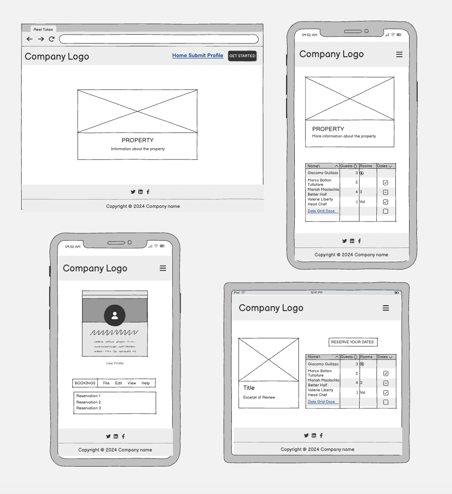
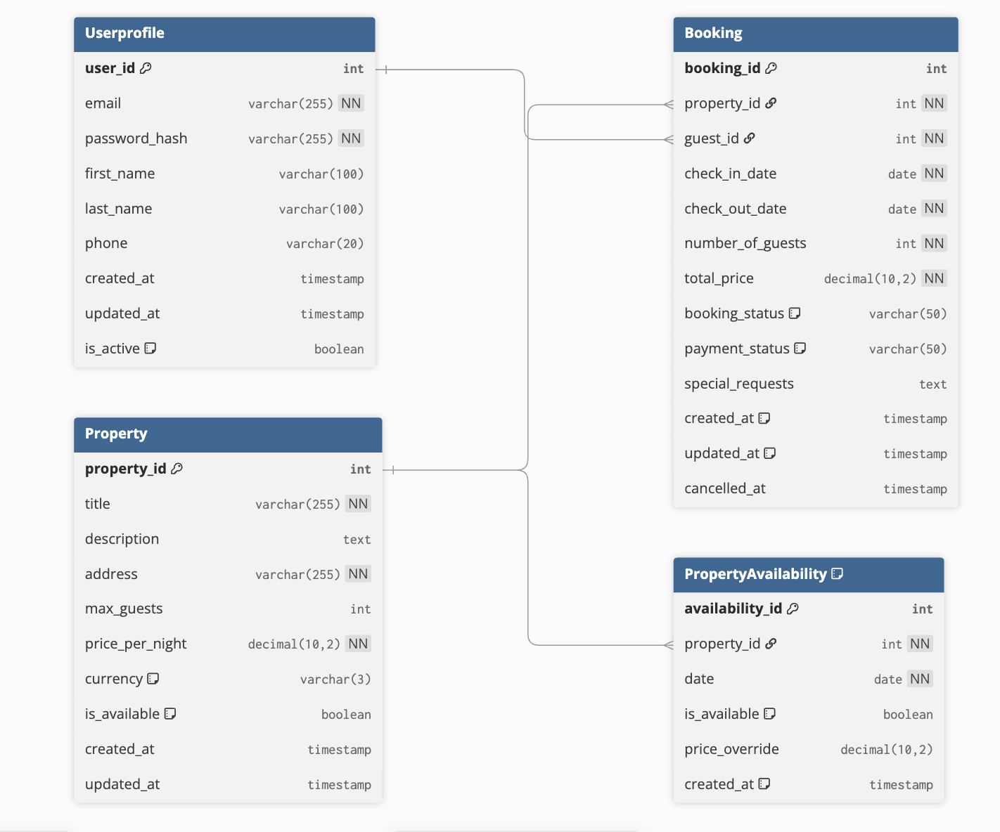
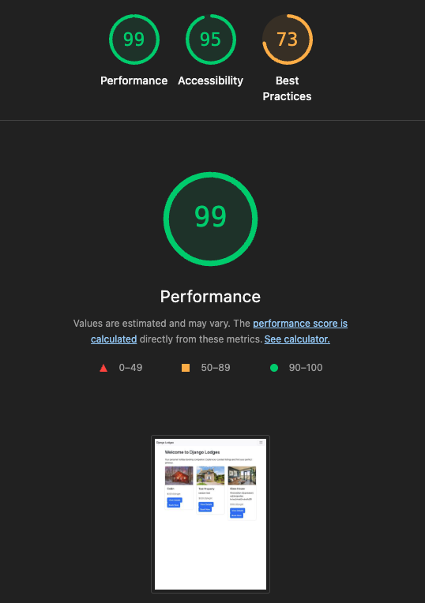
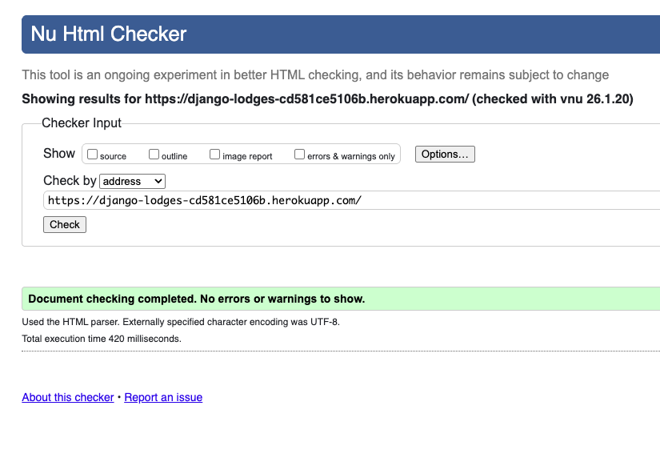

# Hackathon_Django

## Project Overview:
This is a Django-based collaborative project where we created a property booking platform where guests can browse properties, make bookings, and manage their reservations, while admins can manage properties and approve bookings. 

## Core Features
### 1. User Authentication
- User registration and login (powered by Django Allauth)
- Login-required protection for sensitive pages
- User profile management with editable information
- Profile editing with form validation
### 2. Property Management
- Browse all available properties on the homepage
- Display property details (name, location, price per night, description, image)
- Property listing in card format with Bootstrap styling
- Admin panel to add/edit/delete properties
### 3. Booking System
- Guests can book properties by selecting check-in/check-out dates and number of guests
- Automatic availability checking: Properties are available by default unless blocked by confirmed bookings
- Booking status workflow: 
Pending → Confirmed (by admin) → Completed or Cancelled
- Only admin-approved (confirmed) bookings block future bookings
- Price calculation: Total = Price per night × Number of nights
### 4. User Profile & Bookings
- View personal profile with user information
- Edit profile (first name, last name, email, phone)
- View all personal bookings with status badges
- See booking statistics (pending, confirmed, cancelled, completed)
- Cancel pending or confirmed bookings with confirmation page
### 5. Admin Dashboard
- Manage bookings (approve/cancel via bulk actions)
- View all users and their booking history
- Access Django admin panel at 

# Planning - Wireframes and ERD Diagrams:
We used Balsamiq for an initial idea of what we wanted the website to look like. Balsamiq is a great tool for wireframes as you can create realistic basic renditions of your website. The finished website kept the same basic layout on all pages to ensure the website is simple and clean.

We used dbdiagram.io to create our ERD diagrams. ERD diagrams are helpful to visualise how many models and fields are needed. As we worked on our project we realised we didn’t need the availability model and instead were able to combine it with the booking model. 

## User Stories

**US01: As a User, I want to view property details so I can make an informed booking decision.**

Acceptance criteria:

-Page displays property description, photos, address, price per night, and maximum guests.
-Availability calendar is visible.
-Page uses semantic headings and accessible image alt text.

**US02: As a User, I want to check property availability so I can plan my stay.**

Acceptance criteria:

-Calendar highlights available and unavailable dates.
-Calendar is keyboard-navigable and screen-reader friendly.

**US03: As a User, I want to make a booking so I can reserve a stay.**

Acceptance criteria:

-Form allows selection of check-in/check-out dates and number of guests.
-Form validates input and prevents double-booking.
-Confirmation message is shown after successful booking.
-Form is accessible (labels, error messages, ARIA as needed).

**US04: As a User, I want to view my bookings so I can manage my stays.**

Acceptance criteria:

-Page lists current, upcoming, and past bookings.
-Each booking shows property, dates, and status.
-Page uses semantic structure for accessibility.

**US05: As a User, I want to cancel a booking so I can change my plans.**

Acceptance criteria:

-Cancel button is available for upcoming bookings.
-User receives confirmation of cancellation.
-Action is accessible and confirmed with a dialog.

**US06: As a User, I want to register and log in so my data and bookings are secure.**

Acceptance criteria:

-Registration and login forms validate input and provide feedback.
-Passwords are securely handled.
-Forms are accessible (labels, focus order, ARIA as needed).

**US07: As a User, I want to update my profile so my information stays current.**

Acceptance criteria:

-Profile page allows editing name, email, phone, and password.
-Changes are saved and confirmed.
-Page is accessible.

**US08: As a User, I want to receive notifications for booking confirmations and cancellations so I’m always informed.**

Acceptance criteria:

-User receives email or in-app notification for booking events.
-Notifications are accessible and clearly worded.

Project Board:
https://github.com/users/darakhshanda/projects/10

## Testing
### 🧪 Manual Testing Table

#### Authentication & User Management

| Feature            | Expected Result                                            | Result   |
|--------------------|-----------------------------------------------------------|----------|
| User Registration  | New user can register                                     | ✅ Pass  |
| User Login         | Registered user can log in with valid credentials         | ✅ Pass  |
| User Logout        | Logged-in user can successfully log out                   | ✅ Pass  |
| Profile Editing    | User can update name, email, and phone                    | ✅ Pass  |
| Password Change    | User can change password securely                         | ✅ Pass  |

#### Property Browsing & Viewing

| Feature               | Expected Result                                         | Result   |
|-----------------------|--------------------------------------------------------|----------|
| Browse Properties     | All users can view property listings                   | ✅ Pass  |
| View Property Details | Property page shows description, images, price, guests | ✅ Pass  |
| Availability Calendar | Calendar displays available/unavailable dates          | ✅ Pass  |
| Mobile Responsive     | All pages display correctly on mobile devices          |   TBC    |

#### Booking System

| Feature                | Expected Result                                      | Result   |
|------------------------|-----------------------------------------------------|----------|
| Make Booking           | User can book property with valid dates and guests  | ✅ Pass  |
| Prevent Double-Booking | System blocks overlapping bookings                  | ✅ Pass  |
| Booking Confirmation   | User receives confirmation after booking            | ✅ Pass  |
| Cancel Booking         | User can cancel pending/confirmed bookings          | ✅ Pass  |

#### User Profile & Bookings

| Feature               | Expected Result                                     | Result   |
|-----------------------|-----------------------------------------------------|----------|
| View Profile          | User can view personal info and booking stats       |   tbc    |
| View Bookings         | User sees all bookings with status badges           | ✅ Pass  |
| Booking Status Update | Booking status updates (pending, confirmed, etc.)   | ✅ Pass  |

#### Admin Functions

| Feature                  | Expected Result                                   | Result   |
|--------------------------|--------------------------------------------------|----------|
| Add/Edit/Delete Property | Admin can manage property listings               | ✅ Pass  |
| Approve/Cancel Booking   | Admin can approve or cancel bookings             | ✅ Pass  |
| View Users & Bookings    | Admin can view all users and booking history     | ✅ Pass  |
| Admin Dashboard Access   | Only admins can access admin dashboard           | ✅ Pass  |

#### Notifications

| Feature              | Expected Result                                      | Result   |
|----------------------|-----------------------------------------------------|----------|
| Booking Notification | User receives notification for booking events       | ✅ Pass  |

### Lighthouse

### HTML Validation

## AI Usage
- Used GitHub Copilot to generate boilerplate code and speed up repetitive coding tasks.
- Leveraged Copilot to assist with debug issues, such as fixing syntax errors and resolving logic bugs in Django views and models.
- Asked Copilot for explanations of unfamiliar code snippets to better understand use.

## Bugs
- Sign up only requires user name and password. Once submit is clicked, error is shown where duplicate email is found as the email field is null. 

- CSS would not pull through due to incorrect metatag: resolved.

- Calendar availability: Once you selected a already booked date, the site would get stuck in a loop of refreshing. Resolved. 

- Repetitive issue with pulling codebase and having to reinstall from requirements.txt/django/psychopg/env/venv or terminal would throw up loads of errors. 